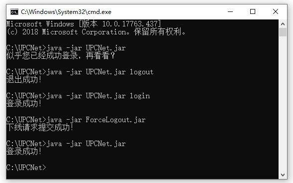

# 中国石油大学（华东）校园网络认证脚本 (Java Version)

> 上次更新日期：2019.4.17

### 登录/正常下线程序使用教程
1. 从[Release](https://github.com/andyliu24/UPCNet/releases "Release")中下载NetAuth.jar
2. 并在同名文件夹建立config.txt并存入数字石大账号密码
3. 从控制台（Windows 使用命令提示符/PowerShell，*nix使用终端）执行`java -jar NetAuth.jar`（登录）、`java -jar NetAuth.jar logout`（退出），稍后程序将运行并显示结果。

### 强制下线程序使用教程
1. 从[Release](https://github.com/andyliu24/UPCNet/releases "Release")中下载ForceLogout.jar
2. 并在同名文件夹建立config.txt并存入数字石大账号密码
3. 从控制台（Windows 使用命令提示符/PowerShell，*nix使用终端）执行`java -jar ForceLogout.jar`，稍后程序将运行并显示结果。

> **提示 & 注意：**
- 登录/正常下线通过控制台传参为logout为正常下线，其余参数和置空均为登录！
- 请保证机器的JRE版本=1.8！


#### 程序运行截图


### 运行环境
本程序采用Java编写，开发JDK版本为1.8，理论上，JRE版本等于或高于1.8均可运行。

### 参数说明

在config.txt文件写入学号、密码和运营商编号等必要参数，然后运行即可。

**注：无需添加任何用于标识其他内容，直接写学号、密码和运营商代码即可。**


配置文件强烈推荐每行一个参数，当然也可以使用空格分隔。

**运营商对应代码：**
```
default -> 校园网
unicom -> 联通
cmcc -> 移动
ctcc -> 电信
local -> 校园内网
```

可自动判别有线/无线网络，实现自动登录。


### 目前支持的网络类型：
````
有线网络（认证地址: http://lan.upc.edu.cn)
无线网络（SSID: UPC, 认证地址: http://wlan.upc.edu.cn）
请务必使用自动获取的DNS地址：121.251.251.250 / 121.251.251.251，其他地址可能拦截遇到问题。
````

### 测试环境
```
Windows 10 1809 (Build 17763.437)
```

### 版权信息

- Java version's author：Andy Liu
- Email: andyliu24@outlook.com
- **Thanks for EndangeredFish's great help!**
- LICENSE: AGPLv3