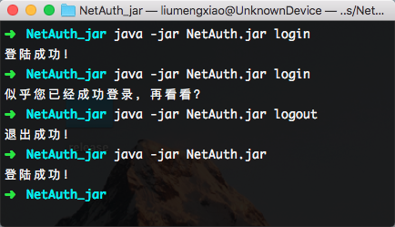

# 中国石油大学（华东）校园网络认证脚本 (Java Version)

### 使用教程
1. 从[Release](https://github.com/andyliu24/UPCNet/releases "Release")中下载NetAuth.jar
2. 并在同名文件夹建立config.txt并存入数字石大账号密码
3. 从控制台（Windows 使用命令提示符/PowerShell，*nix使用终端）执行`java -jar NetAuth.jar`，稍后程序将运行并显示结果。

**注：请保证机器的JRE版本>=1.8！**

#### 程序运行截图


### 运行环境
本程序采用Java编写，开发JDK版本为1.8，JRE版本等于或高于1.8均可运行。

#### JDK调用
主要依赖Java I/O库中的函数实现文件加载和网络流的格式化，并使用`java.net`中一些网络访问的相关方法，此外，借助Scanner实现文件的格式化读取。

```java
java.io.*;
java.net.HttpURLConnection;
java.net.URL;
java.util.Scanner;
```

### 使用方法
在config.txt文件下输入学号、密码和运营商编号，然后运行即可

**注：无需添加任何用于标识其他内容，直接写学号、密码和运营商代码即可。**

强烈推荐每行一个参数，当然也可以使用空格分隔。

运营商对应代码：
```
default -> 校园网
unicom -> 联通
cmcc -> 移动
ctcc -> 电信
local -> 校园内网
```

可自动判别有线/无线网络，实现自动登录。


### 目前支持的网络类型：
````
有线网络（认证地址: http://lan.upc.edu.cn)
无线网络(SSID: UPC, 认证地址: http://121.251.251.217)
````

### 测试环境
```
Windows 10 (Build 17134)
```

### 版权信息

- Java version's author：Andy Liu
- Email: andyliu24@outlook.com
- **Thanks for EndangeredFish's great help!**
- LICENSE: AGPLv3